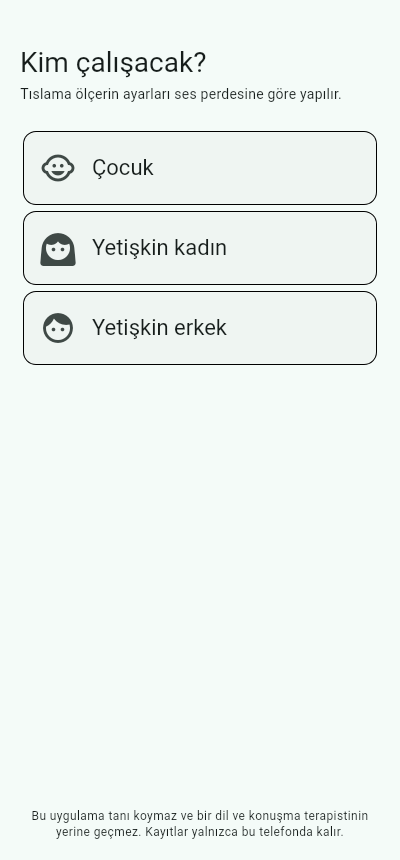
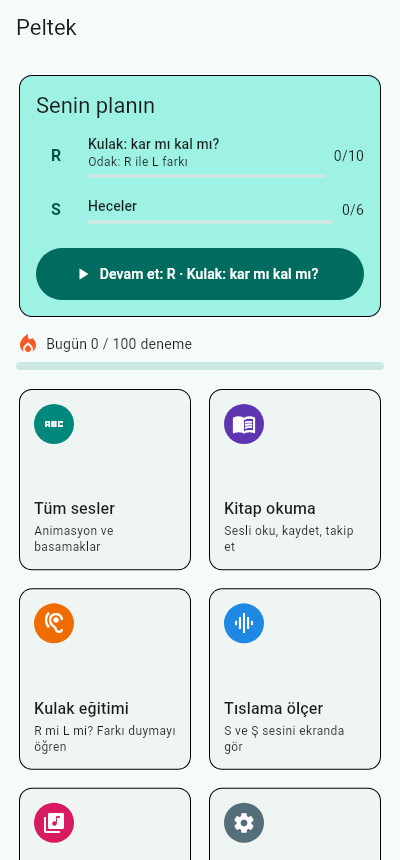
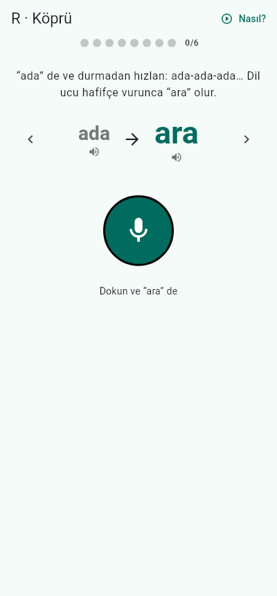
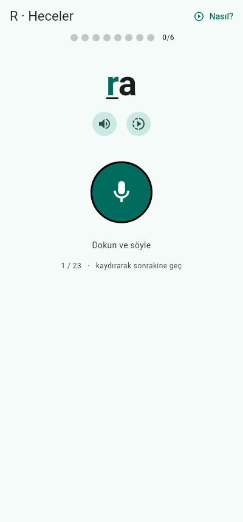

# Peltek

Pelteklik, R söyleyememe, ses değiştirme (R → Y, S → Ş, K → T…) ve kelime/hece
yutma gibi **artikülasyon** sorunları için Türkçe bir Android alıştırma uygulaması.

> **Araştırma özeti:** [docs/ARASTIRMA.md](docs/ARASTIRMA.md): R bozukluğunda
> kendi hatanı duyamamak, görsel geri bildirim, kulak eğitimi ve doz üzerine
> klinik çalışmalar ve uygulamaya nasıl yansıdıkları.

> Bu uygulama bir alıştırma defteridir; tanı koymaz ve bir dil ve konuşma
> terapistinin (DKT) yerine geçmez.

| Başlangıç | Plan | R: D’den R’ye köprü | Alıştırma |
|---|---|---|---|
|  |  |  |  |

## Neler var?

| Bölüm | Ne yapar |
|---|---|
| **Başlangıç ve plan** | İlk açılışta kısa sorular: kim çalışacak, hangi sesler zor ve **nasıl söylüyorsun** (ör. “R’yi L gibi ya da L ile R arası”); ya da kısa tarama testi hatayı kendisi bulur. Ana ekranda kişisel plan ve tek dokunuşla “Devam et”. Her ses basamaklara ayrılır; ses analizi son 8 denemenin 6'sını doğru bulunca basamak geçilir. |
| **Kulak eğitimi** | “R mi L mi?”: telefonun sesi farklı ton ve hızlarda söyler, sen seçersin. **Kendi sesin** modunda eski kayıtlarını dinleyip tahmin edersin, sonra modelin kararını görürsün; “kulak uyumun” ölçülür. İsteğe bağlı “Önce ben tahmin edeyim” ayarı. Plan, R için bu basamakla başlar. |
| **Günlük hedef** | Günlük deneme sayısı hedefi (varsayılan 100); araştırmalarda tekrar sayısı belirleyici. |
| **Kendi hatana odaklı** | Hatanı seçince analiz yalnızca o ayrıma bakar ve sonucu bir **R ←●→ L ibresiyle** gösterir (“R ile L arasında” dahil). Alıştırmalara “kar mı kal mı?” çiftleri eklenir. |
| **R’ye özel** | “D’den R’ye köprü” hazırlığı (ada → ara, R ↔ D ibresi), R kümeleri (tren, kral…), R→Y/L/D/V-W/gırtlak/yutma ayrımı ve her hata için ne yapılacağını söyleyen yönlendirme. |
| **Animasyon** | Ağzın yan kesiti: dil, damak, küçük dil, dişler, dudaklar; R’de dil ucunun diş etine tek vuruşu ve temas dalgası, L’de yapışık dil ve yanlardan akan hava, D/T’de kapanma–basınç–patlama. “Doğrusu / Senin / Üst üste” karşılaştırması, adım adım alt yazı, yavaş çekim. |
| **Sesler** | R, L, S, Z, Ş, Ç, C, K, G, T, D için ağzın yandan kesit **animasyonu** (dil, dişler, dudaklar, hava akışı, ses telleri titreşimi), adım adım söyleyiş, ısınma hareketleri, sık hatalar. S/Z/R/K/G için “doğrusu / sık hata” karşılaştırması (ör. dişler arası peltek S). |
| **Alıştırmalar** | Hece → kelime başı → ortası → sonu → cümle → tekerleme. Her öğede: örneği dinle (normal/yavaş), **kendi sesini kaydet ve dinle**, kendini değerlendir, istersen telefona kontrol ettir. |
| **Kitap okuma** | Özgün kısa hikâyeler + kendi metnini yapıştırma. Üç mod: *Oku* (cümleye dokununca okunuşunu dinle), *Kaydet* (tüm okumayı kaydet), *Takip* (cümle cümle oku; atlanan kelimeler, kısaltılan kelimeler ve “r → y” gibi harf farkları gösterilir). |
| **Benzer kelimeler** | Minimal çiftler (kar/kay, su/şu, kaş/taş…). *Duy ve seç*: kulak eğitimi. *Söyle*: tanıyıcı iki kelimeden hangisini duyduğunu söyler. |
| **Tıslama ölçer** | Mikrofondan canlı spektrum analizi (FFT). S ve Ş seslerinin “tizliğini” ibre ve zaman grafiği olarak gösterir; hedef bölgede kalma süresini sayar. |
| **Kayıtlarım** | Tüm kayıtlar telefonda saklanır; eski ve yeni kaydı art arda dinleyip ilerlemeyi duyabilirsin. |

## “Telefon konuşmayı nasıl değerlendiriyor?” — dürüst cevap

1. **Ses analizi: telefonda çalışan fonem modeli (ana yöntem).**
   [ZIPA](https://github.com/lingjzhu/zipa) çok dilli ses birimi tanıma modeli
   (70 MB, int8 ONNX, CC BY 4.0) APK'nın içinde geliyor; internet gerekmez,
   ses telefondan çıkmaz. Kelimeyi değil **sesleri** tanır ve duyduğunu
   düzeltmez. Kelimenin doğru hâli ile bilinen hatalı hâlleri (radyo / yadyo /
   ladyo / adyo / gırtlaktan R) yarıştırılır.
   - Gerçek insan sesinde (FLEURS) doğru söyleyişe “yanlış” deme oranı:
     R %1,4, L %0,8, K %1,1, S ve Ş %0.
   - Sentetik “R yerine Y” ve “R yerine D” söyleyişlerinin hiçbirine “doğru”
     demedi: ya hatayı adlandırdı ya da “net değil” dedi. R yerine V/W zayıf.
   - **Çocuk sesinde ve gerçek konuşma bozukluğunda henüz ölçülmedi.**
     Ayrıntılar: [docs/MODEL_DEGERLENDIRME.md](docs/MODEL_DEGERLENDIRME.md).
2. **Android’in konuşma tanıyıcısı:** yalnızca kitap okumada ve cümlelerde
   **atlanan kelimeleri** bulmak için. Yanlış sesi doğru kelimeye
   düzelttiği için telaffuz değerlendirmesinde kullanılmıyor. Dinleme
   boyunca ses hiç yükselmediyse sonucu yok sayılır.
3. **Tıslama ölçer** (`lib/audio/sibilant_analyzer.dart`): S ↔ Ş ayrımını
   canlı gösterir.
4. **Kendi kulağın:** analiz edilen her söyleyiş kaydedilir, dinleyebilirsin.

## APK nasıl alınır?

Her push’ta GitHub Actions (`.github/workflows/android.yml`) analiz + test
çalıştırır ve release APK üretir.

- **Son derleme:** GitHub → *Actions* → *Android APK* → son çalıştırma →
  *Artifacts* → `apk-arm64` (zip olarak iner, içinden `peltek-….apk` çıkar).
  Çok eski 32 bit telefonlar için `apk-armv7`. Boyut ~90 MB; bunun 70 MB'ı
  ses modeli.
- **Sürüm yayınlamak:** `git tag v0.1.0 && git push origin v0.1.0` → APK
  *Releases* sayfasına eklenir.
- Telefona kurarken “bilinmeyen kaynaklardan yükleme” izni istenir.

### Kalıcı imza (önemli)

İmza anahtarı tanımlı değilse CI her seferinde rastgele bir debug anahtarıyla
imzalar; **yeni APK eskisinin üstüne kurulamaz**, önce eskisini silmek gerekir
(bu da telefondaki kayıtları siler). Bunu bir kez düzeltmek için:

```bash
keytool -genkey -v -keystore peltek.jks -keyalg RSA -keysize 2048 \
        -validity 10000 -alias peltek
base64 -w0 peltek.jks > peltek.jks.b64
```

Depo → *Settings* → *Secrets and variables* → *Actions* altına ekle:

| Secret | Değer |
|---|---|
| `ANDROID_KEYSTORE_BASE64` | `peltek.jks.b64` içeriği |
| `ANDROID_KEYSTORE_PASSWORD` | keystore şifresi |
| `ANDROID_KEY_ALIAS` | `peltek` |
| `ANDROID_KEY_PASSWORD` | anahtar şifresi |

`peltek.jks` dosyasını depoya **koyma** ve kaybetme: kaybedersen kullanıcılar
güncelleme alamaz.

## Geliştirme

```bash
./tool/fetch_model.sh                  # ses modelini indir (70 MB, SHA-256 doğrulamalı)
flutter pub get
flutter analyze
flutter test --exclude-tags render     # birim + widget testleri
flutter test --update-goldens --tags render test/render   # ekran görüntüleri
# uçtan uca model testi (Linux masaüstü; linux/ klasörü git'e girmez)
flutter create --platforms linux . && xvfb-run flutter test integration_test -d linux
flutter run                            # bağlı telefonda
flutter build apk --release
```

Flutter 3.47.6 (stable), Android minSdk Flutter varsayılanı.

```
lib/
  audio/sibilant_analyzer.dart   FFT ile S/Ş spektrum analizi
  audio/fbank.dart               Kaldi uyumlu log-mel özellikleri (modelin girdisi)
  audio/phoneme_model.dart       ONNX fonem modeli (flutter_onnxruntime)
  audio/pronunciation_scorer.dart  doğru / hatalı söyleyiş hipotezlerini yarıştırma
  audio/voice_capture.dart       16 kHz ses yakalama, sessizlik algılama
  utils/text_align.dart          hedef metin ↔ duyulan metin hizalama (yutma, harf farkı)
  utils/turkish.dart             Türkçe küçük harf / normalizasyon (I/ı, İ/i)
  data/                          sesler, minimal çiftler, hikâyeler (içerik burada)
  services/                      kayıt, konuşma tanıma, metin okuma, ayarlar
  widgets/mouth_animation.dart   ağız kesiti animasyonu
  screens/                       ekranlar
```

İçerik eklemek kod bilgisi gerektirmez: yeni kelime, cümle ya da hikâye için
`lib/data/` altındaki listelere ekleme yapman yeterli.

## Atıflar

- Ses modeli: **ZIPA** — Jian Zhu ve ark., *ZIPA: A family of efficient
  models for multilingual phone recognition*, ACL 2025.
  [github.com/lingjzhu/zipa](https://github.com/lingjzhu/zipa) ·
  ağırlıklar [CC BY 4.0](https://creativecommons.org/licenses/by/4.0/).
- Model çalıştırma: [ONNX Runtime](https://onnxruntime.ai) (MIT),
  [flutter_onnxruntime](https://pub.dev/packages/flutter_onnxruntime).
