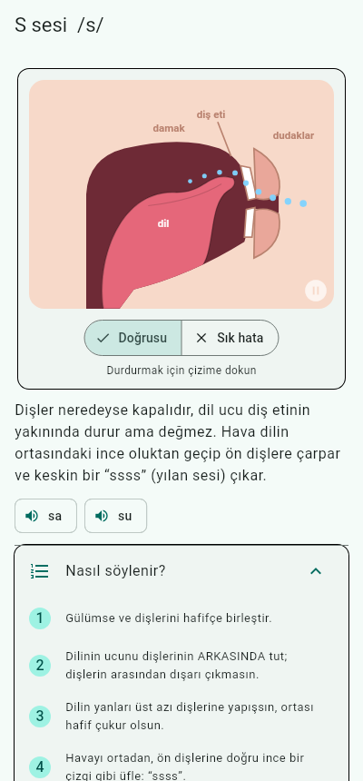
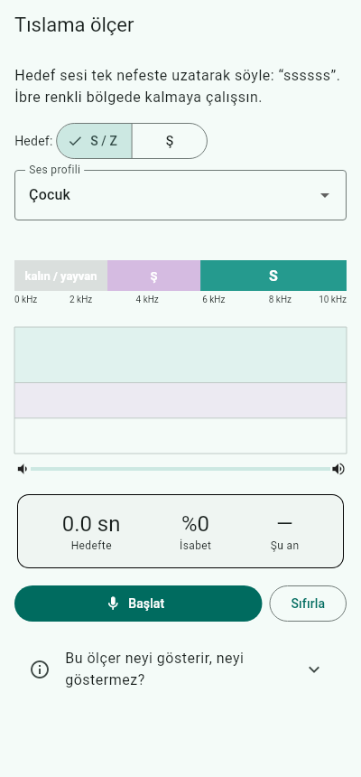

# Peltekliğe Lanet

Pelteklik, R söyleyememe, ses değiştirme (R → Y, S → Ş, K → T…) ve kelime/hece
yutma gibi **artikülasyon** sorunları için Türkçe bir Android alıştırma uygulaması.

> Bu uygulama bir alıştırma defteridir; tanı koymaz ve bir dil ve konuşma
> terapistinin (DKT) yerine geçmez.

| Ana ekran | S sesi | Alıştırma | Tıslama ölçer |
|---|---|---|---|
|  |  |  |  |

## Neler var?

| Bölüm | Ne yapar |
|---|---|
| **Sesler** | R, L, S, Z, Ş, Ç, C, K, G, T, D için ağzın yandan kesit **animasyonu** (dil, dişler, dudaklar, hava akışı, ses telleri titreşimi), adım adım söyleyiş, ısınma hareketleri, sık hatalar. S/Z/R/K/G için “doğrusu / sık hata” karşılaştırması (ör. dişler arası peltek S). |
| **Alıştırmalar** | Hece → kelime başı → ortası → sonu → cümle → tekerleme. Her öğede: örneği dinle (normal/yavaş), **kendi sesini kaydet ve dinle**, kendini değerlendir, istersen telefona kontrol ettir. |
| **Kitap okuma** | Özgün kısa hikâyeler + kendi metnini yapıştırma. Üç mod: *Oku* (cümleye dokununca okunuşunu dinle), *Kaydet* (tüm okumayı kaydet), *Takip* (cümle cümle oku; atlanan kelimeler, kısaltılan kelimeler ve “r → y” gibi harf farkları gösterilir). |
| **Benzer kelimeler** | Minimal çiftler (kar/kay, su/şu, kaş/taş…). *Duy ve seç*: kulak eğitimi. *Söyle*: tanıyıcı iki kelimeden hangisini duyduğunu söyler. |
| **Tıslama ölçer** | Mikrofondan canlı spektrum analizi (FFT). S ve Ş seslerinin “tizliğini” ibre ve zaman grafiği olarak gösterir; hedef bölgede kalma süresini sayar. |
| **Kayıtlarım** | Tüm kayıtlar telefonda saklanır; eski ve yeni kaydı art arda dinleyip ilerlemeyi duyabilirsin. |

## “Telefon konuşmayı nasıl değerlendiriyor?” — dürüst cevap

Uygulama bugün üç farklı yöntem kullanıyor, her birinin sınırı farklı:

1. **Android’in kendi konuşma tanıyıcısı** (`speech_to_text`). Ayarlarda
   “mümkünse telefonda” açıkken telefonun çevrimdışı tanıyıcısı tercih edilir.
   *Garanti değil:* telefonda cihaz içi tanıyıcı yoksa Android normal
   tanıyıcıya geçer ve ses Google sunucularına gidebilir. Kayıtlar ve
   tıslama ölçer ise tamamen telefonda kalır. **Sınırı:** Bu tanıyıcılar *kelime* bulmak için eğitilmiştir;
   hafif bozuk söyleyişi çoğu zaman doğru kelimeye “düzeltir”. Bu yüzden:
   - Atlanan / yutulan kelimeleri yakalamada **iyi**,
   - Minimal çiftlerde (iki tarafı da gerçek kelime) **makul**,
   - Tek bir sesin ne kadar düzgün çıktığını ölçmede **zayıf**.
2. **Tıslama ölçer** (kendi kodumuz, `lib/audio/sibilant_analyzer.dart`).
   S ↔ Ş ayrımını ve yanal S’yi iyi gösterir; dişler arası S’yi her zaman
   ayıramaz. Mikrofon ve uzaklık değerleri kaydırır.
3. **Kendi kulağın.** Kaydet → dinle → değerlendir döngüsü, terapide de
   kullanılan öz-izleme yöntemidir ve şu an en güvenilir ölçüttür.

Ses düzeyinde gerçek değerlendirme için telefonda çalışan kendi fonem
modelimizin planı: [docs/YOL_HARITASI.md](docs/YOL_HARITASI.md).

## APK nasıl alınır?

Her push’ta GitHub Actions (`.github/workflows/android.yml`) analiz + test
çalıştırır ve release APK üretir.

- **Son derleme:** GitHub → *Actions* → *Android APK* → son çalıştırma →
  *Artifacts* → `apk` (zip olarak iner, içinden `.apk` çıkar).
- **Sürüm yayınlamak:** `git tag v0.1.0 && git push origin v0.1.0` → APK
  *Releases* sayfasına eklenir.
- Telefona kurarken “bilinmeyen kaynaklardan yükleme” izni istenir.

### Kalıcı imza (önemli)

İmza anahtarı tanımlı değilse CI her seferinde rastgele bir debug anahtarıyla
imzalar; **yeni APK eskisinin üstüne kurulamaz**, önce eskisini silmek gerekir
(bu da telefondaki kayıtları siler). Bunu bir kez düzeltmek için:

```bash
keytool -genkey -v -keystore peltek.jks -keyalg RSA -keysize 2048 \
        -validity 10000 -alias peltek
base64 -w0 peltek.jks > peltek.jks.b64
```

Depo → *Settings* → *Secrets and variables* → *Actions* altına ekle:

| Secret | Değer |
|---|---|
| `ANDROID_KEYSTORE_BASE64` | `peltek.jks.b64` içeriği |
| `ANDROID_KEYSTORE_PASSWORD` | keystore şifresi |
| `ANDROID_KEY_ALIAS` | `peltek` |
| `ANDROID_KEY_PASSWORD` | anahtar şifresi |

`peltek.jks` dosyasını depoya **koyma** ve kaybetme: kaybedersen kullanıcılar
güncelleme alamaz.

## Geliştirme

```bash
flutter pub get
flutter analyze
flutter test --exclude-tags render     # birim + widget testleri
flutter test --update-goldens --tags render test/render   # ekran görüntüleri
flutter run                            # bağlı telefonda
flutter build apk --release
```

Flutter 3.47.6 (stable), Android minSdk Flutter varsayılanı.

```
lib/
  audio/sibilant_analyzer.dart   FFT ile S/Ş spektrum analizi
  utils/text_align.dart          hedef metin ↔ duyulan metin hizalama (yutma, harf farkı)
  utils/turkish.dart             Türkçe küçük harf / normalizasyon (I/ı, İ/i)
  data/                          sesler, minimal çiftler, hikâyeler (içerik burada)
  services/                      kayıt, konuşma tanıma, metin okuma, ayarlar
  widgets/mouth_animation.dart   ağız kesiti animasyonu
  screens/                       ekranlar
```

İçerik eklemek kod bilgisi gerektirmez: yeni kelime, cümle ya da hikâye için
`lib/data/` altındaki listelere ekleme yapman yeterli.
